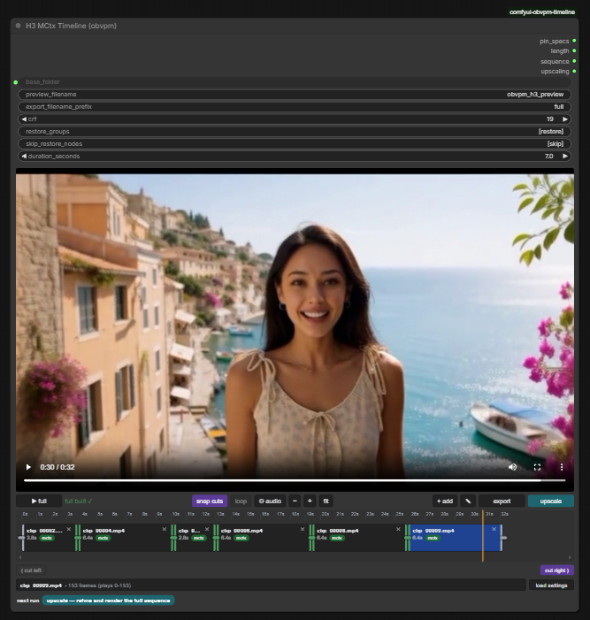

# comfyui-obvpm-timeline

A MiniMax H3 ComfyUI workflow and nodes that allow generating, extending, prepending, bridging and editing videos in an easy to use UI.

The timeline node is like a mini video editor.

And it also supports creating seamless looping videos.



## Support this work

If these nodes and workflows save you time, consider supporting their development on Patreon. **Supporters get early access to new features and workflows.**

<a href="https://www.patreon.com/cw/obvpm"></a>

## Updates

### 0.1.1 (2026-09-23)

- **Update [comfyui-obvpm](https://github.com/chanon/comfyui-obvpm) to the latest version (0.2.5 or newer) as well.** It fixes compatibility bugs the timeline workflow runs into: presets not switching on ComfyUI frontend 1.53 (ComfyUI 0.37), Bundle pin names on a non-English frontend, and the "Converting circular structure to JSON" error when loading the workflow from a saved video with Nodes 2.0 on ComfyUI 0.36.
- Fixed: upscaling a timeline short enough to fit in one sampling window (about 7.8 s at the default window of 39) failed at the refine sampler with `TypeError: list indices must be integers or slices, not NoneType`. Longer timelines were not affected.
- The Timeline node refuses to run on a ComfyUI or comfyui-obvpm too old for the workflow (ComfyUI 0.35.0, comfyui-obvpm 0.2.5), saying what to update and where, instead of failing downstream.
- The package published to the Comfy Registry no longer contains the tests and CI helpers, only the pack itself (`.comfyignore`).

### 0.1.0 (2026-09-21)

- First release.

## Watch the Tutorial

The best way to learn how to use the Timeline and workflow is by watching the YouTube tutorial video:

[](https://youtu.be/kqP09NfJXaQ)

**Watch on YouTube: [https://youtu.be/kqP09NfJXaQ](https://youtu.be/kqP09NfJXaQ)**

## Features

The main node is the **Timeline** node: the clips you generate are placed on it, and it is where you arrange, cut and preview them, and pick which clip the next generation continues from.

Generate a clip, see if you like it, add it to the timeline, then extend from it. Any part you don't like can be redone later.

Every generated clip is saved together with a motion context file (`.mctx`) that holds its latents. Extensions continue from those original latents using latent masks, not from re-encoded pixels, so there are no lighting changes or flickers at the joins. And because the files sit next to the clips, a clip can still be extended at full quality days or months later.

**Generating**

- **Extend** a clip seamlessly.
- **Prepend**: generate what happens *before* a clip
- **Bridge**: generate what happens between the end of one clip and the beginning of another. This lets you redo any section of the video, and bridging onto a fresh generation brings the quality back if it has drifted.
- **Loop**: bridge the last clip back to the first clip to make a seamless looping video.
- **Extend from a cut**: if a clip ends badly, cut off the bad part and extend from the good part. Snap cuts keeps cuts on the latent frame grid.
- Clips that have no motion context (external clips, clips from other workflows) can be extended too, with seam improvements applied automatically.
- **Result preview**: plays each new clip joined to its neighbours and rates how seamless the join is. From there you add it to the timeline, delete it or dismiss it.
- **Model preview override**: Integrated into the result preview. Lets you quickly see if a generation is going wrong.

**Timeline**

- **Mini Video Editor**: Drag in clips from anywhere, reorder them by dragging, trim the ends, cut left / cut right at the playhead, undo cuts, and open gaps.
- **Quick preview**: plays through the clips right away. **Full preview** assembles them into a single video file, losslessly where possible. **Export** saves the finished video.
- **Load Settings, Prompts from Clips**: restores the prompt, seed, settings and references that a clip was generated with, so you don't have to keep track of them yourself.
- **Swap takes**: Swap between previous takes generated for the same extension, so you can go back to them and swap between them on the timeline.
- The sequence is also available as text, for copying a timeline into another workflow.

**Upscaling**

- A latent upscale and refine of the **whole sequence in one pass**, so details stay consistent across the joins and the result is still seamless.
- Sampling is done in windows, so long or high resolution videos still fit in VRAM.
- Generate at low resolution for fast iteration, then upscale once at the end. This is optional, you can also generate the first pass at final quality.
- Each clip's conditioning is saved with it, so the upscale uses the same references the clip was generated with.

**Workflow**

- Organized for fast and easy use. All inputs are in one area. No pan all over the workflow to change things.
- **Settings Presets**: Allows you to save frequently used settings such as steps, turbo, and sampling settings and control them in one place
- Up to four image references, plus video and audio references. (More can be added)

## Dependencies

**ComfyUI 0.35.0 (2026-09-09) or newer is needed:** the workflow's Model Optimization uses core's `Model Sparse Attention` node, which arrived there.

The workflows use these custom node packs, so install all of them:

| Custom node pack                                                                                       | Used for                                                             |
| ------------------------------------------------------------------------------------------------------ | -------------------------------------------------------------------- |
| [comfyui-obvpm-timeline](https://github.com/chanon/comfyui-obvpm-timeline) (this pack)                 | The Timeline node, pins, joint render, upscale pass, result preview  |
| [comfyui-obvpm](https://github.com/chanon/comfyui-obvpm) (0.2.5 or newer)                              | Bundles, Settings Presets, switches and gates, Load Images & Compose |
| [ComfyUI-KJNodes](https://github.com/kijai/ComfyUI-KJNodes)                                            | Set / Get nodes, model preview override, Sage attention patch        |
| [Comfyui_Minimax_h3_latent_Upscaler](https://github.com/LBH-123-AI/Comfyui_Minimax_h3_latent_Upscaler) | The latent upscaler used by the upscale pass                         |
| [ComfyUI-MiniMax-H3-Turbo](https://github.com/Larryvrh/ComfyUI-MiniMax-H3-Turbo)                       | Turbo LoRA loader for larryvrh turbo                                 |
| [ComfyUI-Spectrum-MiniMax-H3](https://github.com/xmarre/ComfyUI-Spectrum-MiniMax-H3)                   | Spectrum acceleration                                                |
| [rgthree-comfy](https://github.com/rgthree/rgthree-comfy)                                              | Power Lora Loader                                                    |

### IMPORTANT Compatibility Warnings

**Latent upscaler: use the original pack, not the "Plus" fork.** The workflow was built with [LBH-123-AI/Comfyui_Minimax_h3_latent_Upscaler](https://github.com/LBH-123-AI/Comfyui_Minimax_h3_latent_Upscaler). The fork [xmarre/Comfyui_Minimax_h3_latent_Upscaler-Plus](https://github.com/xmarre/Comfyui_Minimax_h3_latent_Upscaler-Plus) registers a node with the **same id and name** but a different set of widgets. Only one of the two can be installed at a time, and with the fork installed the workflow loads wrong:

- **Symptom:** on the *H3 Latent Upscaler 3D* node, `device` shows `true` and `precision` shows `cuda`, and the run fails until both are set by hand.
- **Cause:** the fork removed the `enable_temporal_chunking` and `force_unload` widgets, so every saved value after `align` lands one field too far along.
- **Why not just fix the two fields:** the fork also removed **temporal chunking**, and the upscale pass relies on it. Without it the upscaler normalises over the whole sequence at once, which on longer timelines produces the drifting, hallucinated detail this workflow was tuned to avoid.

If you see the symptom, uninstall the Plus fork, install the original pack, restart ComfyUI and reload the workflow.

**"MiniMax H3 Video Extend (Backported)" causes colour shifts at the joins.** The pack [kat3ri/ComfyUI-MiniMax-H3-Extend](https://github.com/kat3ri/ComfyUI-MiniMax-H3-Extend) (nodes *MiniMax H3 Video Extend (Backported)* and *MiniMax H3 Encode AV (Patched)*) does not just add nodes: at import time it **replaces** two core ComfyUI functions, `MiniMaxH3.extra_conds` and `PackedLayout.__init__`, with copies taken from an older ComfyUI. Those copies affect every H3 sampling run in the session, even in workflows that never use its nodes.

- **Symptom:** an extension's colours and brightness drift away from the clip it continues, or the join has a visible colour/brightness step, even though the timeline's own extensions are normally seamless.
- **Cause:** this pack extends through latent masks. Current ComfyUI passes those masks into the model as per-token denoise masks, so the preserved context frames are run at the clean-conditioning timestep. The replaced `extra_conds` predates that mechanism and silently drops the masks, so the model treats the preserved frames as if they were fully noised and re-renders the continuation against context it cannot see properly. The replaced `PackedLayout` also rejects interior keyframe anchors, which the pin nodes need.
- **Detection:** the mctx pin nodes stop with an error naming the foreign patch. Plain extends do not: they run and simply look wrong.

If you have this pack installed, remove it, restart ComfyUI and re-run the extension. The related [pmhaidn/ComfyUI-Minimax-H3-Extender](https://github.com/pmhaidn/ComfyUI-Minimax-H3-Extender) *wraps* the core function instead of replacing it and leaves the current layout code alone, so it has not shown this problem; it does patch the Turbo LoRA loader, so if you see odd Turbo behaviour with it installed, try without it.

## Installation

Clone (or copy) this folder into `ComfyUI/custom_nodes`:

```
cd ComfyUI/custom_nodes
git clone https://github.com/chanon/comfyui-obvpm-timeline
```

Restart ComfyUI. No extra Python dependencies are required. 

## Workflow

The workflow is available in the [workflows](https://github.com/chanon/comfyui-obvpm-timeline/tree/main/workflows) folder.

## Other Notes

Every node in this pack is listed with **(obvpm)** after its name, so
searching the node menu for `obvpm` finds all of them. The names used
throughout this documentation leave that suffix off.

**AI Generated docs:**

**[docs/h3.md](docs/h3.md)** 
**[docs/h3-nodes.md](docs/h3-nodes.md)**

## License

[GPL-3.0](LICENSE). See
[THIRD_PARTY_NOTICES](THIRD_PARTY_NOTICES.md) for acknowledgments.
